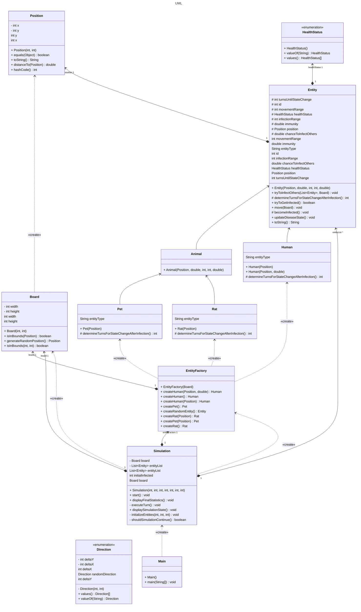

```mermaid
---
title: UML
---
classDiagram
direction BT
class Animal {
  + Animal(Position, double, int, int, double) 
}
class Board {
  + Board(int, int) 
  - int width
  - int height
  + isInBounds(Position) boolean
  + generateRandomPosition() Position
  + isInBounds(int, int) boolean
   int width
   int height
}
class Direction {
<<enumeration>>
  - Direction(int, int) 
  - int deltaY
  - int deltaX
  + values() Direction[]
  + valueOf(String) Direction
   int deltaX
   Direction randomDirection
   int deltaY
}
class Entity {
  + Entity(Position, double, int, int, double) 
  # int turnsUntilStateChange
  # int id
  # int movementRange
  # HealthStatus healthStatus
  # int infectionRange
  # double immunity
  # Position position
  # double chanceToInfectOthers
  + tryToInfectOthers(List~Entity~, Board) void
  # determineTurnsForStateChangeAfterInfection() int
  + tryToGetInfected() boolean
  + move(Board) void
  # becomeInfected() void
  + updateDiseaseState() void
  + toString() String
   int movementRange
   double immunity
   String entityType
   int id
   int infectionRange
   double chanceToInfectOthers
   HealthStatus healthStatus
   Position position
   int turnsUntilStateChange
}
class EntityFactory {
  + EntityFactory(Board) 
  + createHuman(Position, double) Human
  + createHuman() Human
  + createHuman(Position) Human
  + createPet() Pet
  + createRandomEntity() Entity
  + createRat(Position) Rat
  + createPet(Position) Pet
  + createRat() Rat
}
class HealthStatus {
<<enumeration>>
  + HealthStatus() 
  + valueOf(String) HealthStatus
  + values() HealthStatus[]
}
class Human {
  + Human(Position) 
  + Human(Position, double) 
  # determineTurnsForStateChangeAfterInfection() int
   String entityType
}
class Main {
  + Main() 
  + main(String[]) void
}
class Pet {
  + Pet(Position) 
  # determineTurnsForStateChangeAfterInfection() int
   String entityType
}
class Position {
  + Position(int, int) 
  - int x
  - int y
  + equals(Object) boolean
  + toString() String
  + distanceTo(Position) double
  + hashCode() int
   int y
   int x
}
class Rat {
  + Rat(Position) 
  # determineTurnsForStateChangeAfterInfection() int
   String entityType
}
class Simulation {
  + Simulation(int, int, int, int, int, int, int) 
  - Board board
  - List~Entity~ entityList
  + start() void
  + displayFinalStatistics() void
  - executeTurn() void
  + displaySimulationState() void
  - initializeEntities(int, int, int) void
  - shouldSimulationContinue() boolean
   List~Entity~ entityList
   int initialInfected
   Board board
}

Animal  -->  Entity 
Board  ..>  Position : «create»
Entity "1" *--> "healthStatus 1" HealthStatus 
Entity "1" *--> "position 1" Position 
EntityFactory "1" *--> "board 1" Board 
EntityFactory  ..>  Human : «create»
EntityFactory  ..>  Pet : «create»
EntityFactory  ..>  Rat : «create»
Human  -->  Entity 
Main  ..>  Simulation : «create»
Pet  -->  Animal 
Rat  -->  Animal 
Simulation "1" *--> "board 1" Board 
Simulation  ..>  Board : «create»
Simulation "1" *--> "entityList *" Entity 
Simulation "1" *--> "entityFactory 1" EntityFactory 
Simulation  ..>  EntityFactory : «create»
```