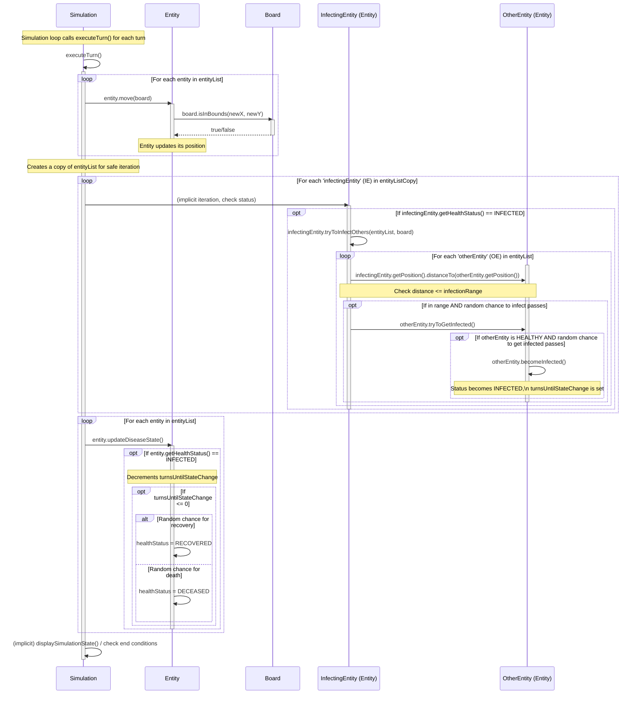

```mermaid
sequenceDiagram
    participant Sim as Simulation
    participant E as Entity
    participant B as Board
    participant IE as InfectingEntity (Entity)
    participant OE as OtherEntity (Entity)

    Note over Sim: Simulation loop calls executeTurn() for each turn

    Sim ->> Sim: executeTurn()
    activate Sim

    %% Phase 1: Movement %%
    loop For each entity in entityList
        Sim ->> E: entity.move(board)
        activate E
        E ->> B: board.isInBounds(newX, newY)
        activate B
        B -->> E: true/false
        deactivate B
        Note over E: Entity updates its position
        deactivate E
    end

    %% Phase 2: Infection %%
    Note over Sim: Creates a copy of entityList for safe iteration
    loop For each 'infectingEntity' (IE) in entityListCopy
        Sim ->> IE: (implicit iteration, check status)
        activate IE
        opt If infectingEntity.getHealthStatus() == INFECTED
            IE ->> IE: infectingEntity.tryToInfectOthers(entityList, board)
            loop For each 'otherEntity' (OE) in entityList
                activate OE
                IE ->> OE: infectingEntity.getPosition().distanceTo(otherEntity.getPosition())
                Note over IE, OE: Check distance <= infectionRange
                opt If in range AND random chance to infect passes
                    IE ->> OE: otherEntity.tryToGetInfected()
                    opt If otherEntity is HEALTHY AND random chance to get infected passes
                        OE ->> OE: otherEntity.becomeInfected()
                        Note over OE: Status becomes INFECTED,\n turnsUntilStateChange is set
                    end
                end
                deactivate OE
            end
        end
        deactivate IE
    end

    %% Phase 3: Update Disease State %%
    loop For each entity in entityList
        Sim ->> E: entity.updateDiseaseState()
        activate E
        opt If entity.getHealthStatus() == INFECTED
            Note over E: Decrements turnsUntilStateChange
            opt If turnsUntilStateChange <= 0
                alt Random chance for recovery
                    E ->> E: healthStatus = RECOVERED
                else Random chance for death
                    E ->> E: healthStatus = DECEASED
                end
            end
        end
        deactivate E
    end

    Sim ->> Sim: (implicit) displaySimulationState() / check end conditions
    deactivate Sim
```