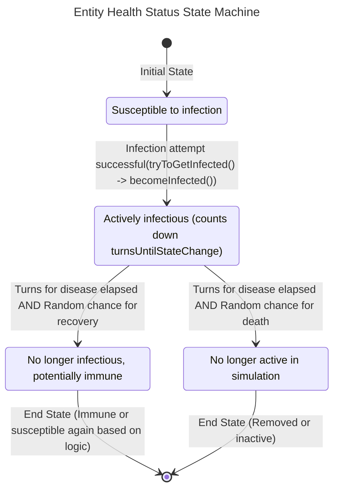

```mermaid
---
title: Entity Health Status State Machine
---
stateDiagram-v2
    [*] --> HEALTHY : Initial State

    HEALTHY --> INFECTED : Infection attempt successful(tryToGetInfected() -> becomeInfected())
    HEALTHY : Susceptible to infection

    INFECTED --> RECOVERED : Turns for disease elapsed <br> AND Random chance for recovery
    INFECTED --> DECEASED : Turns for disease elapsed AND Random chance for death
    INFECTED : Actively infectious (counts down turnsUntilStateChange)

    RECOVERED --> [*] : End State (Immune or susceptible again based on logic)
    RECOVERED : No longer infectious, potentially immune

    DECEASED --> [*] : End State (Removed or inactive)
    DECEASED : No longer active in simulation
```