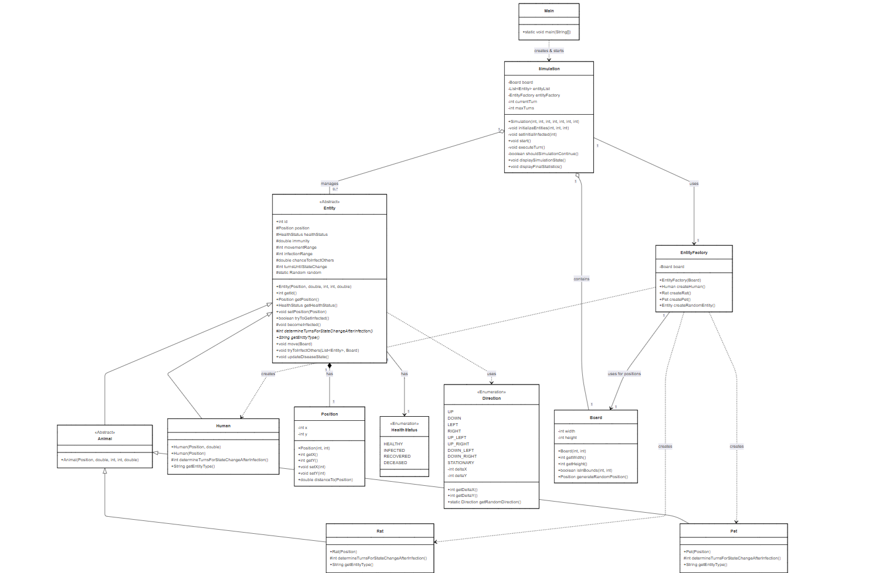
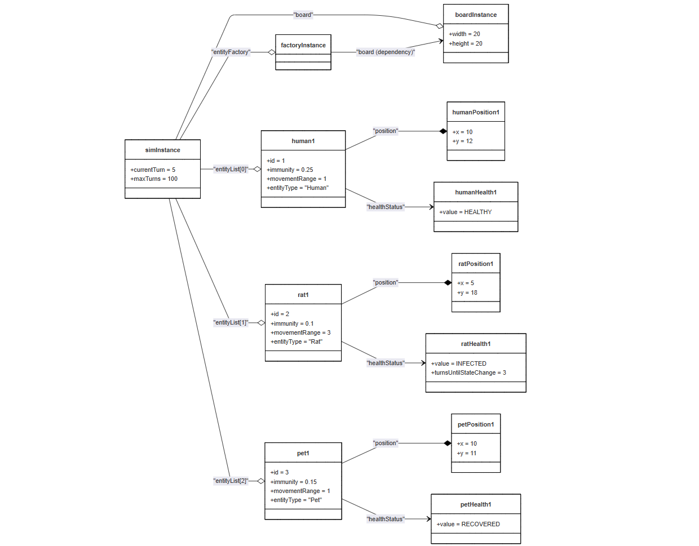
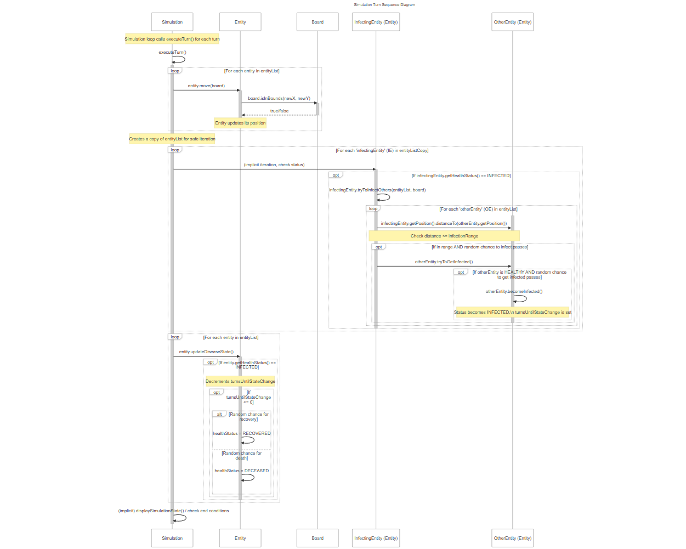
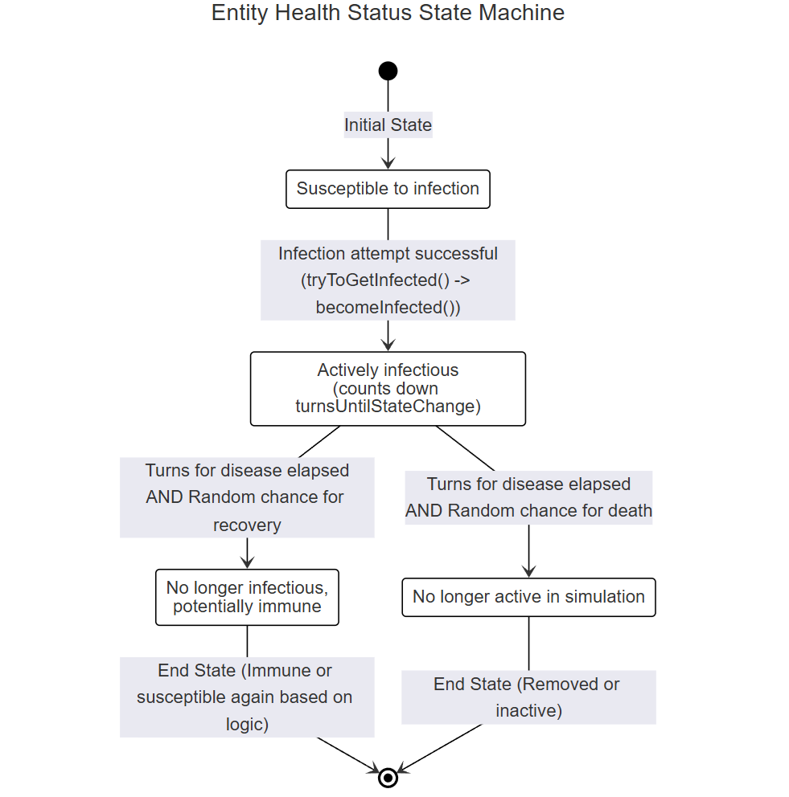
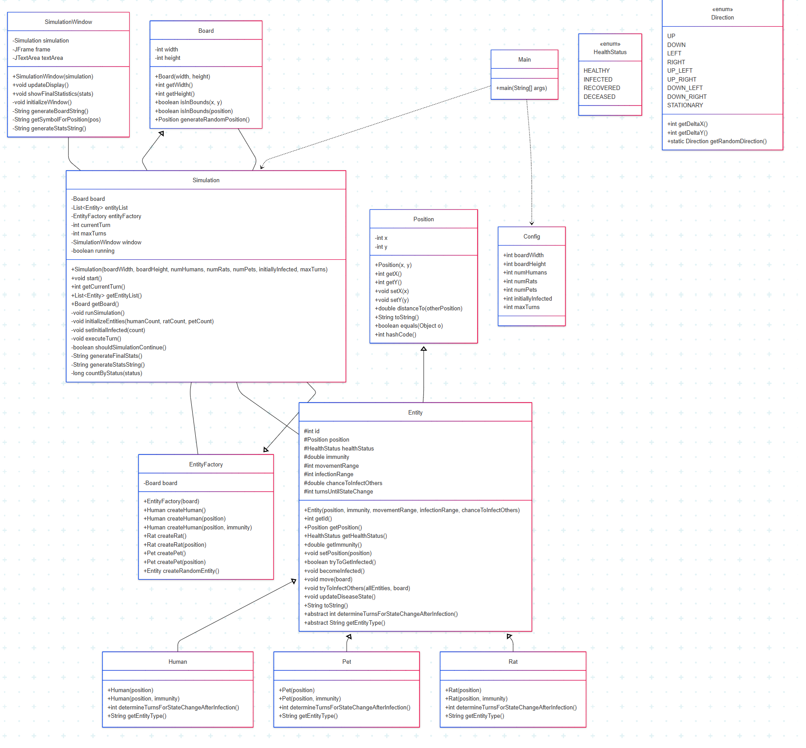
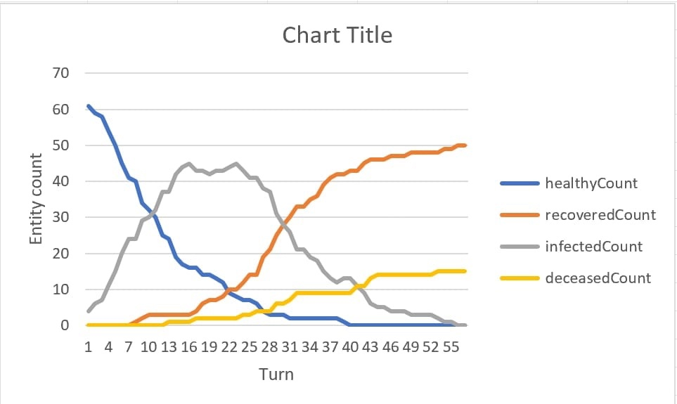

# Projekt na zajęcia laboratoryjne z Programowania obiektowego - *Furrocław*

## Specyfika

Projekt tworzony jest w języku Java.

## Członkowie zespołu

- Krystian Śliwiński - lider
- Adam Maciejczuk
- Magdalena Wasik

## Opis projektu
Symulacja rozprzestrzeniania się choroby w populacji w mieście (Furrocław).   
Podmioty symulacji:  
Ludzie o różnym stopniu odporności,   
Zwierzęta mogące roznosić chorobę (np. Szczury szybko będą się poruszać, jednak mogą zarażać na małą odległość, zwierzęta domowe poruszają się w tempie ludzi, lecz są bardziej skuteczne w zarażaniu).


Obiekty są losowo rozstawiane na dwuwymiarowej planszy o zadanej wielkości. Symulacja zaczyna się od zadanej ilości chorych podmiotów. W każdej iteracji obiekty poruszają się w losowych kierunkach na określony dla danego obiektu dystans. Każdy obiekt rozprzestrzenia chorobę na określoną przestrzeń i zaraża podmioty w niej się znajdujące. Podmioty mają określoną szansę na zarażenie się. Podmiot po losowym czasie może umrzeć lub wyzdrowieć.

## Cel projektu
Głównym celem projektu jest stworzenie elastycznego i konfigurowalnego modelu symulacyjnego, który pozwoli obserwować dynamikę epidemii w zależności od zdefiniowanych parametrów.

## Zaimplementowane funkcjonalności
- stworzenie mapy (grid 2D)
- stworzenie zwierząt i ludzi
- stworzenie funkcji rysującej mapę
- stworzenie funkcji aktualizującej mapę

## Technologie 
- Język programowania: Java,
- Obsługa konfiguracji: Plik config.json (parsowany przy użyciu biblioteki Jackson),
- Logowanie danych: Zapis statystyk z każdej tury do pliku CSV.

## Architektura Systemu

System składa się z kilku kluczowych komponentów:

### Główne Klasy

* **`Main`**: Punkt wejściowy aplikacji. Wczytuje konfigurację i uruchamia symulację.
* **`Config`**: Klasa wewnętrzna w `Main`, przechowująca parametry konfiguracyjne wczytane z pliku JSON.
* **`Simulation`**: Główna klasa zarządzająca przebiegiem symulacji. Odpowiada za inicjalizację, pętlę tur, interakcje między encjami oraz logowanie wyników.
* **`Board`**: Reprezentuje dwuwymiarową planszę, na której poruszają się encje. Definiuje granice mapy.
* **`Position`**: Prosta klasa przechowująca współrzędne (x, y) na planszy.
* **`EntityFactory`**: Fabryka odpowiedzialna za tworzenie instancji różnych typów encji.

### Encje (`org.alefajnyprojekt.entities`)

* **`Entity` (abstrakcyjna)**: Klasa bazowa dla wszystkich bytów w symulacji. Definiuje wspólne atrybuty (ID, pozycja, stan zdrowia, odporność, zasięg ruchu, zasięg infekcji) i zachowania (ruch, próba infekcji, aktualizacja stanu zdrowia).
* **`Human`**: Reprezentuje człowieka. Dziedziczy po `Entity`.
* **`Animal` (abstrakcyjna)**: Klasa bazowa dla zwierząt. Dziedziczy po `Entity`.
* **`Rat`**: Reprezentuje szczura. Dziedziczy po `Animal`.
* **`Pet`**: Reprezentuje zwierzę domowe. Dziedziczy po `Animal`.

### Typy Wyliczeniowe (`org.alefajnyprojekt.enums`)

* **`HealthStatus`**: Definiuje możliwe stany zdrowia encji (`HEALTHY`, `INFECTED`, `RECOVERED`, `DECEASED`).
* **`Direction`**: Definiuje możliwe kierunki ruchu encji na planszy.

### Narzędzia

* **`DataLogger`**: Klasa odpowiedzialna za zapisywanie statystyk z każdej tury symulacji do pliku CSV. Nazwa pliku zawiera aktualną datę i losowy numer.

## 4. Konfiguracja (`config.json`)

Symulacja jest konfigurowana za pomocą pliku `config.json` umieszczonego w głównym katalogu projektu. Przykładowa struktura:

```json
{
  "boardWidth": 50,
  "boardHeight": 50,
  "numHumans": 100,
  "numRats": 20,
  "numPets": 10,
  "initiallyInfected": 5,
  "maxTurns": 200
}
```


## Struktura projektu

```
│   .DS_Store
│   
└───main
    │   .DS_Store
    │   
    └───java
        └───org
            └───alefajnyprojekt
                │   Board.java
                │   EntityFactory.java
                │   Main.java
                │   Position.java
                │   Simulation.java
                │   SimulationWindow.java
                │   
                ├───entities
                │       Animal.java
                │       Entity.java
                │       Human.java
                │       Pet.java
                │       Rat.java
                │       
                └───enums
                        Direction.java
                        HealthStatus.java

```

## Dokumentacja

Dokumentacja znajduje się w folderze `doc`. Są to pliki `*.html`.

## Diagramy UML z etapu III

Poniżej są przedstawione diagramy UML utworzone na potrzeby kroku milowego III.

> W finalnej wersji projektu kod aplikacji został wzbogadzony o więcej metod niż te przewidywane w poprzednich etapach.

### Diagram klas



### Diagram obiektów



### Diagram sekwencji



### Diagram maszyny stanów




## Uaktualniony diagram klas



## Przykładowy wykres



